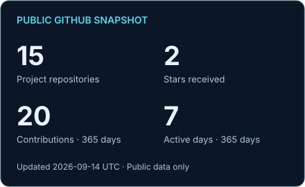
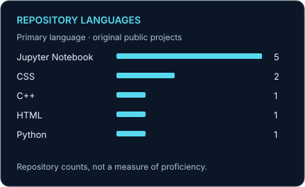
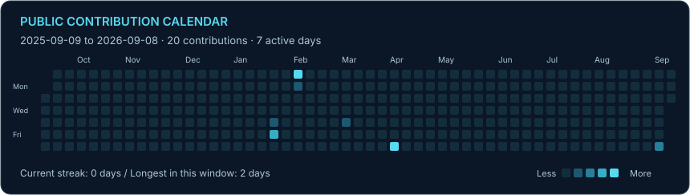

<picture>
  <source media="(prefers-reduced-motion: reduce)" srcset="assets/header-static.svg">
  
</picture>

# Turning data into something useful.

I'm **Prakhyat**, a data analyst with an **Integrated M.Tech in CSE, specializing in Artificial Intelligence, from VIT Bhopal**. I build dashboards, explore datasets, and develop machine-learning projects that connect technical analysis with understandable results.

My work spans **Python, SQL, Power BI, and Tableau** — from sales and product analytics to sentiment classification and Flask applications.

**[Portfolio ↗](https://prakhyat-srivastava.github.io/My_Portfolio/)** &nbsp; / &nbsp; **[LinkedIn ↗](https://www.linkedin.com/in/prakhyat-nandan-srivastava)** &nbsp; / &nbsp; **[Résumé ↗](https://prakhyat-srivastava.github.io/My_Portfolio/assets/resume.pdf)** &nbsp; / &nbsp; **[Email ↗](mailto:prakhyatsrivastava024@gmail.com)**

[Selected work](#01--selected-work) · [Toolkit](#02--toolkit) · [Background & research](#03--background--research) · [GitHub activity](#04--github-activity)

## 01 / Selected work

### [Analytics Platform Admin Dashboard ↗](https://github.com/Prakhyat-Srivastava/analytics-platform-admin-dashboard-powerbi)

<!-- REPO-analytics-platform-admin-dashboard-powerbi:START -->
Latest repository push: 2026-04-04 · 0 stars · 0 forks

Power BI take\-home assignment project for an analytics platform admin dashboard\. Includes a two\-page dashboard for usage monitoring, retention, and funnel analysis, plus synthetic linked CSV data, ER diagram, Theme 1 documentation, and a Theme 2 secure document access solution proposal\.
<!-- REPO-analytics-platform-admin-dashboard-powerbi:END -->

**PRODUCT ANALYTICS** &nbsp; `Power BI` `Data modeling` `Retention & funnels`

[Explore the repository](https://github.com/Prakhyat-Srivastava/analytics-platform-admin-dashboard-powerbi) · [Retention & funnel view](https://github.com/Prakhyat-Srivastava/analytics-platform-admin-dashboard-powerbi/blob/main/images/adoption_retention_funnel.png) · [Data model](https://github.com/Prakhyat-Srivastava/analytics-platform-admin-dashboard-powerbi/blob/main/images/data_model.png)

### [Amazon Product Sentiment Analysis ↗](https://github.com/Prakhyat-Srivastava/Amazon_Product_Sentiment_Analysis)

<!-- REPO-Amazon_Product_Sentiment_Analysis:START -->
Latest repository push: 2024-09-23 · 0 stars · 0 forks

Sentiment analysis on Amazon product reviews using Logistic Regression\. The project focuses on handling class imbalance and fine\-tuning the model to balance precision and recall\. Includes model export and TF\-IDF vectorizer for future deployment\.
<!-- REPO-Amazon_Product_Sentiment_Analysis:END -->

**NATURAL LANGUAGE PROCESSING** &nbsp; `Python` `scikit-learn` `NLTK` `Flask`

**Worth exploring:** text preprocessing, class-weighted learning, and threshold analysis — with attention to minority-class performance.

### [Movie Rating Prediction ↗](https://github.com/Prakhyat-Srivastava/movie-rating-prediction)

<!-- REPO-movie-rating-prediction:START -->
Latest repository push: 2024-12-29 · 0 stars · 0 forks

Predicting movie ratings using regression models based on various features like genre, director, and actors
<!-- REPO-movie-rating-prediction:END -->

**APPLIED MACHINE LEARNING** &nbsp; `Python` `XGBoost` `Flask`

**Worth exploring:** the path from feature engineering and model training to an application interface.

### [Heart Disease Analysis ↗](https://github.com/Prakhyat-Srivastava/HeartDisease-Analysis)

<!-- REPO-HeartDisease-Analysis:START -->
Latest repository push: 2024-04-21 · 2 stars · 1 forks

This project uses data analytics for heart disease pattern analysis\. It involves meticulous data extraction, cleaning, and exploratory analysis\. The project provides detailed visualizations and reports, serving as a valuable resource for better understanding of heart health\.
<!-- REPO-HeartDisease-Analysis:END -->

**EXPLORATORY ANALYTICS** &nbsp; `Python` `pandas` `Tableau`

**Worth exploring:** analysis across age, gender, and clinical attributes. An exploratory data project, not a clinical diagnostic tool.

<strong>More dashboards & development work</strong>

- **[Amazon Sales Dashboard](https://github.com/Prakhyat-Srivastava/Amazon-Sales-Dashboard)** — Power BI views of revenue, profit, sales channels, regions, and product categories.
- **[Employee Attrition Dashboard](https://github.com/Prakhyat-Srivastava/Employee-Attrition-Dashboard)** — Power BI exploration of attrition across roles, satisfaction, tenure, and commuting distance.
- **[SN Crop Dashboard](https://github.com/Prakhyat-Srivastava/SN-Crop-Dashboard-PowerBI-Project)** — an early Power BI project exploring crop data.
- **[Personal Portfolio](https://github.com/Prakhyat-Srivastava/My_Portfolio)** — a responsive HTML, CSS, and JavaScript portfolio with projects and credentials.

## 02 / Toolkit

  
  
  
  
  
  
  
  
  
  

- **Analyze & prepare:** Python, pandas, NumPy, SQL, Excel, and R; data cleaning, EDA, and feature engineering.
- **Visualize & explain:** Power BI, DAX, Power Query, and Tableau; KPI reporting and interactive dashboards.
- **Model & build:** scikit-learn, XGBoost, NLTK, Flask, and Jupyter; classification, regression, and model evaluation.
- **Present on the web:** HTML, CSS, JavaScript, and Git.

## 03 / Background & research

**Integrated M.Tech (CSE), Artificial Intelligence · VIT Bhopal · 2025** 
Hands-on data analytics training at **AnalytixLabs (2025)** and a **Data Analytics internship at Internship Studio (April–May 2024)**. [Background and experience ↗](https://prakhyat-srivastava.github.io/My_Portfolio/#experience)

**Published research** 
Co-author of *[Optimized Machine Learning framework for Sentiment Analysis for Amazon Product Reviews](https://journal.esrgroups.org/jes/article/view/8003)*, with A. Sirajudeen. **Journal of Electrical Systems, 2024.** DOI: `10.52783/jes.8003`

**Selected credentials**

- [Advanced Certification in Data Analytics](https://github.com/Prakhyat-Srivastava/My_Portfolio/blob/main/images/IIT_DA.png) — Electronics & ICT Academy, IIT Guwahati · June 2025
- [Certified Data Analyst — Python](https://github.com/Prakhyat-Srivastava/My_Portfolio/blob/main/images/analytixlabs_DA_python.png) — AnalytixLabs · June 2025
- [AWS Certified Solutions Architect — Associate](https://github.com/Prakhyat-Srivastava/My_Portfolio/blob/main/images/aws_solutions_architect.png) — issued January 2024; valid through January 2027

[View the complete credential collection ↗](https://prakhyat-srivastava.github.io/My_Portfolio/#certifications)

## 04 / GitHub activity

<!-- RECENT-PROJECTS:START -->
**Recently updated repositories**

- **[analytics\-platform\-admin\-dashboard\-powerbi](https://github.com/Prakhyat-Srivastava/analytics-platform-admin-dashboard-powerbi)** · pushed 2026-04-04
  Power BI take\-home assignment project for an analytics platform admin dashboard\. Includes a two\-page dashboard for usage monitoring, retention, and funnel analysis, plus synthetic linked CSV data, ER diagram, Theme 1 documentation, and a Theme 2 secure document access solution proposal\.
- **[My\_Portfolio](https://github.com/Prakhyat-Srivastava/My_Portfolio)** · pushed 2026-03-04
  A dynamic and interactive portfolio showcasing my skills, projects, and certifications as a Data Analyst &amp; Developer\. Powered by HTML, CSS, and JavaScript\.
- **[movie\-rating\-prediction](https://github.com/Prakhyat-Srivastava/movie-rating-prediction)** · pushed 2024-12-29
  Predicting movie ratings using regression models based on various features like genre, director, and actors
<!-- RECENT-PROJECTS:END -->

<strong>Contribution calendar & streaks</strong>

Refreshed daily from public GitHub data; update dates appear on the cards. Language counts describe repository contents, not proficiency. [Data & definitions](docs/activity.md).

---

**Let's connect over data, dashboards, and useful software.** 
[prakhyatsrivastava024@gmail.com](mailto:prakhyatsrivastava024@gmail.com) · [LinkedIn](https://www.linkedin.com/in/prakhyat-nandan-srivastava) · [Portfolio](https://prakhyat-srivastava.github.io/My_Portfolio/)
